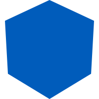

<!-- markdownlint-disable-next-line -->
<p align="center">
  <a href="https://github.com/tony21921/ngx-material-nested-nav" rel="noopener" target="_blank"></a>
</p>

# NgxMaterialNestedNav

NgxMaterialNestedNav is an Angular Material component that supports nested navigation lists with multiple types of icons (Material, Font, SVG) and links (route, URL). The SVG icons can either use their original color or be overridden with the theme icon color.

## Features

- Nested navigation lists with expandable/collapsible items
- Supports different types of icons: Material, Font, SVG
- Route and URL links
- Divider support

## Installation

To install the package, run:

```sh
npm install @tony21921/ngx-nested-nav-list
```

## NestedNavList Component

### Defining the Data

The data for the navigation list is defined using the `NavData` interface. Here is an example:

```ts
export interface NavData {
  displayName: string;
  iconType?: 'font' | 'svg';
  iconName?: string;
  fontSet?: string;
  svgUrl?: string;
  route?: string;
  url?: string;
  children?: NavData[];
  expanded?: boolean;
  keepQueryParams?: boolean;
  type?: 'divider';
}
```

### Usage of Different Types of Icons

You can use Material, Font, and SVG icons in the navigation list. Here is an example of how to define the data with different types of icons:

```ts
navData: NavData[] = [
  {
    displayName: 'Home',
    iconType: 'font',
    iconName: 'fa-house',
    fontSet: 'fa',
    route: 'home',
  },
  {
    displayName: 'Settings',
    iconName: 'settings',
    children: [
      {
        displayName: 'Profile',
        iconName: 'person',
        route: 'profile',
      },
      {
        displayName: 'Notifications',
        iconName: 'notifications',
        keepQueryParams: true,
        route: 'notifications',
      },
    ],
  },
  {
    type: 'divider',
  },
  {
    displayName: 'Repo',
    iconType: 'svg',
    svgUrl: 'github.svg',
    url: 'https://github.com'
  },
];
```

### How to Register Font for Material Icon

To register a font for Material Icon, you can use the `MatIconRegistry` service as introduced in [Material](https://material.angular.io/components/icon/overview#registering-icons) documentation. Here is an example:

```ts
import { MatIconRegistry } from '@angular/material/icon';

...
export class AppComponent {
  constructor(matIconRegistry: MatIconRegistry) {
    matIconRegistry.registerFontClassAlias('fontawesome', 'fa');
  }
  ...
}
```

### Divider

You can add a divider in the navigation list by setting the `type` property to `divider` in the `NavData` object. Here is an example:

```ts
{
  type: 'divider',
}
```

## Usage

To use the `NestedNavListComponent`, you need to import it in your Angular module or standalone component. Here is an example:

### In a Module

```ts
import { NgModule } from '@angular/core';
import { BrowserModule } from '@angular/platform-browser';
import { AppComponent } from './app.component';
import { NestedNavListComponent } from '@tony21921/ngx-nested-nav-list';

@NgModule({
  declarations: [AppComponent],
  imports: [BrowserModule, NestedNavListComponent],
  bootstrap: [AppComponent],
})
export class AppModule {}
```

### In a Standalone Component

```ts
import { Component } from '@angular/core';
import { NestedNavListComponent } from '@tony21921/ngx-nested-nav-list';

@Component({
  selector: 'app-root',
  standalone: true,
  imports: [NestedNavListComponent],
  template: ` <ngx-nested-nav-list [navData]="navData"></ngx-nested-nav-list> `,
})
export class AppComponent {
  navData = [
    // your nav data here
  ];
}
```

## Development server

Run `ng serve` for a dev server. Navigate to `http://localhost:4200/`. The application will automatically reload if you change any of the source files.

## Build

Run `npm run build:lib` to build the project. The build artifacts will be stored in the `dist/` directory.

## Running unit tests

Run `npm run test` to execute the unit tests via [Jest](https://jestjs.io/).

## Running end-to-end tests

Run `ng e2e` to execute the end-to-end tests with [Cypress](https://www.cypress.io/) on the dev-app application.

## Contribution

Contributions are welcome! Please open an issue or submit a pull request.

## License

This project is licensed under the MIT License. See the [LICENSE](https://github.com/tony21921/ngx-material-nested-nav/blob/main/LICENSE) file for more details.
